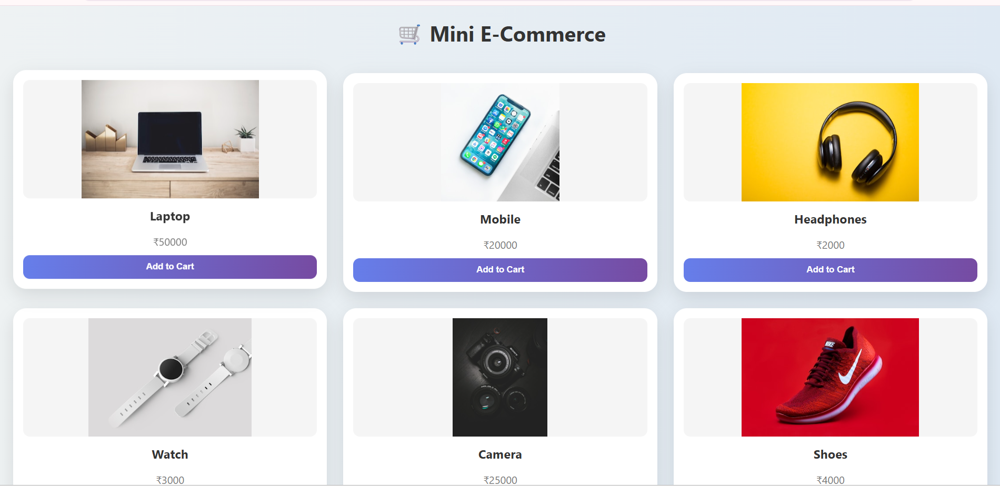

# 🛒 Mini E-Commerce Website

A simple and interactive **E-Commerce Web Application** built using **HTML, CSS, and JavaScript**.  
Users can browse products, add items to cart, and view the total amount with a checkout summary.

---

## 🚀 Features

- 🛍️ Product listing with images  
- 🛒 Add to cart functionality  
- ❌ Remove items from cart  
- 💰 Dynamic total price calculation  
- 🧾 Checkout / Order summary page  
- 🎨 Attractive UI with modern design  

---

## 🛠️ Technologies Used

- HTML  
- CSS  
- JavaScript  

---

## 📁 Project Structure

ecommerce/  
│── index.html  
│── style.css  
│── script.js  
│── screenshot1.png  
│── screenshot2.png  
│── README.md  

---

## 📸 Screenshots

### 🛍️ Product Page

### 🧾 Order Summary Page

---

## ▶️ How to Run

1. Download or clone the repository  
2. Open the project folder  
3. Double-click `index.html`  
4. The app will open in your browser  

---

## 🧠 How It Works

- Products are stored in a JavaScript array  
- Users can add/remove items from cart  
- Total price is calculated dynamically  
- Checkout displays final order summary  

---

## 🌟 Future Improvements

- 🔍 Search functionality  
- 🛒 Quantity update (+ / -)  
- 💾 Save cart using local storage  
- 💳 Payment UI integration   

---

## 📌 Note

This project is built for learning and frontend practice purposes.